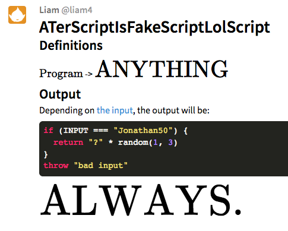

# just run a file

easy peasy:

    clone stuff
    cd this directory
    npm install
    node index.js demo.atsifslols

# wait what do i input

idk I think I wrote it somewhere on gitter.

so if you were *you* then you'd never find it

but you're probably somebody I know

so you probably know anyways!11

oh wait i wrote it in the repl section lol

# can i use this as an npm dependency???

lol no

# repl

the REPL can be accessed by running index.js without any arguments.

example usage:

    aterscriptisfakescriptlolscript $ node repl.js
    Program code?> lol      
    Getting grammar..
    Making grammar..
    Feeding code..
    Depending on code..
    lol
    Generating program..
    INPUT>> 8249
    bad input
    Program code?> lel
    Getting grammar..
    Making grammar..
    Feeding code..
    Depending on code..
    lel
    Generating program..
    INPUT>> Jonathan50
    ??
    Program code?> 

# Documentation

[Donate?](http://redirectatob.github.io/index.html#aHR0cHM6Ly95b3V0dS5iZS95UVpwTmFrNmxtUQ==)
